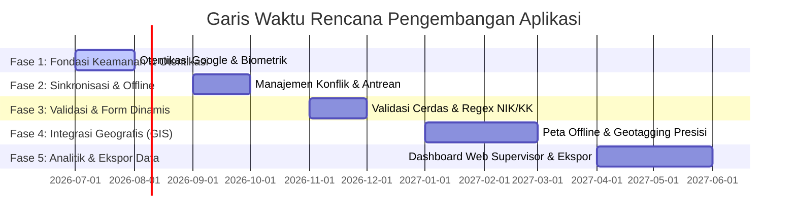

# Rencana Pengembangan (Roadmap) Aplikasi Desa Cantik Sangihe

Dokumen ini berisi peta jalan (roadmap) dan rencana pengembangan teknis jangka menengah hingga panjang untuk aplikasi **Desa Cantik (Desa Cinta Statistik)** Kabupaten Kepulauan Sangihe. Rencana ini disusun untuk meningkatkan keamanan, stabilitas, efisiensi kerja petugas lapangan, serta validitas data sensus.

---

## 📅 Ringkasan Fase Pengembangan

---

## 🔒 Fase 1: Keamanan & Otentikasi Lanjutan
Fokus utama adalah memperkuat keamanan akses petugas ke database lokal dan server.

- **Integrasi Otentikasi Google (OAuth2)**
  - Mengaktifkan fitur masuk menggunakan akun Google resmi BPS (`@bps.go.id`) untuk mempermudah pendaftaran dan meningkatkan verifikasi identitas.
- **Login Biometrik (Sidik Jari / Wajah)**
  - Menambahkan dukungan sidik jari (Fingerprint) atau pengenalan wajah (Face Unlock) menggunakan package `local_auth` di Flutter agar petugas lapangan tidak perlu mengetik password secara berulang kali di lapangan.
- **Penyimpanan Lokal Terenkripsi**
  - Mengenkripsi database draf lokal (Shared Preferences / Hive) menggunakan AES-256 agar data pribadi penduduk (NIK, KK, dll.) aman meskipun perangkat hilang atau diretas.

---

## 🔄 Fase 2: Sinkronisasi Cerdas & Mode Offline Premium
Mengingat keterbatasan jaringan internet di wilayah kepulauan Sangihe, keandalan sistem offline dan manajemen antrean data sangat krusial.

- **Manajemen Konflik Data (Conflict Resolution)**
  - Menambahkan mekanisme penanganan konflik data jika terdapat draf survei dengan KK/NIK yang sama yang di-upload oleh dua petugas berbeda (strategi *Merge*, *Overwrite*, atau *Keep Both*).
- **Sinkronisasi Latar Belakang (Background Sync)**
  - Menggunakan background fetcher (`workmanager` di Flutter) agar aplikasi secara otomatis melakukan sinkronisasi data yang belum terkirim ketika tablet mendeteksi koneksi internet yang stabil, tanpa mengharuskan aplikasi tetap terbuka.
- **Kompresi Data Gambar**
  - Mengurangi ukuran foto rumah (Blok II) secara otomatis sebelum diunggah ke server backend untuk menghemat kuota internet petugas lapangan.

---

## 📝 Fase 3: Validasi Cerdas & Formulir Dinamis
Meningkatkan kualitas input data agar meminimalisir kesalahan manusia (human error) saat pengisian formulir.

- **Masking & Format Otomatis untuk NIK dan Nomor KK**
  - Memasang validasi format angka wajib 16 digit dan struktur penulisan NIK berdasarkan kode wilayah Sangihe (`7103...`) secara real-time.
- **Validasi Logika Lintas Blok (Cross-Validation)**
  - Menerapkan aturan logika otomatis. Contoh: jika usia di bawah 15 tahun (Blok IV), maka status pernikahan (Blok IV) otomatis terkunci pada opsi "Belum Kawin" dan profesi dikunci pada "Tidak/Belum Bekerja".
- **Formulir Dinamis dari Server (Remote Config)**
  - Mengatur susunan pertanyaan survei dari server backend, sehingga jika ada perubahan kuesioner dari pusat, aplikasi tidak perlu di-update melalui file APK, melainkan cukup mengunduh skema form baru secara dinamis.

---

## 🗺️ Fase 4: Geotagging & Integrasi Peta Offline (GIS)
Memperkuat penandaan lokasi rumah tangga untuk mempermudah pemetaan statistik spasial.

- **Peta Offline (Offline Map Tiles)**
  - Memungkinkan petugas mengunduh peta dasar wilayah tugas (desa/kelurahan) ke dalam memori tablet sehingga fitur peta tetap berfungsi di daerah *blank spot*.
- **Pendeteksi Jarak Geotagging**
  - Menghitung jarak antara koordinat lokasi petugas saat ini dengan batas wilayah SLS (Satuan Lingkungan Setempat) untuk mendeteksi potensi salah wilayah pendataan.
- **Penyimpanan Multi-Koordinat (Poligon)**
  - Bukan hanya koordinat titik (point) rumah, tetapi juga mendukung perekaman batas poligon wilayah pemukiman desa.

---

## 📊 Fase 5: Dashboard Analytics & Ekspor Data (Supervisor)
Memberikan alat pemantauan yang komprehensif bagi koordinator sensus tingkat kabupaten.

- **Ekspor Data Multi-Format**
  - Menambahkan tombol ekspor data hasil sensus dari server backend ke format Microsoft Excel (`.xlsx`), CSV, atau JSON secara langsung demi kemudahan analisis lanjutan oleh tim pengolah data BPS.
- **Visualisasi Geografis (ArcGIS / Leaflet Integration)**
  - Menampilkan sebaran rumah tangga hasil survei dalam bentuk peta panas (*heatmap*) pada dashboard supervisor web.
- **Statistik Kinerja Petugas**
  - Grafik produktivitas harian petugas lapangan untuk memantau progres pendataan secara real-time demi mencapai target 100% tepat waktu.
